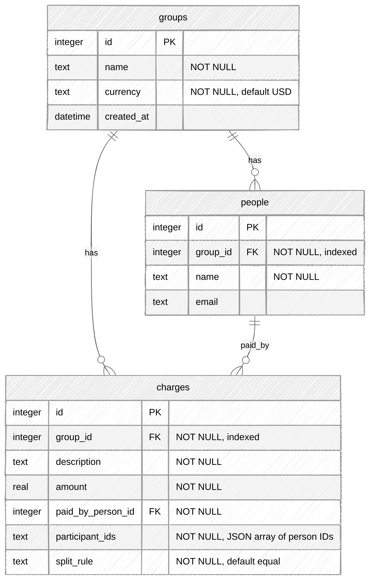

# Shared Bill Splitter — Database Schema

SQLite database (`billsplitter.db`) managed by GORM AutoMigrate.

## Relationships

| From | To | Cardinality | How |
|------|----|-------------|-----|
| `groups` | `people` | 1 : N | `people.group_id` → `groups.id` |
| `groups` | `charges` | 1 : N | `charges.group_id` → `groups.id` |
| `people` | `charges` | 1 : N (payer) | `charges.paid_by_person_id` → `people.id` |
| `people` | `charges` | N : M (participants) | `charges.participant_ids` stores a JSON array of person IDs (no join table) |

## Notes for presentation

- **Three tables** — `groups`, `people`, `charges` — no separate settlement or transfer tables; settle results are computed on read.
- **Participants** are stored as JSON text on each charge, not as foreign-key rows. The API exposes them as `participantIds` in JSON responses.
- **Indexes** exist on `people.group_id` and `charges.group_id` for listing people/charges within a group.
