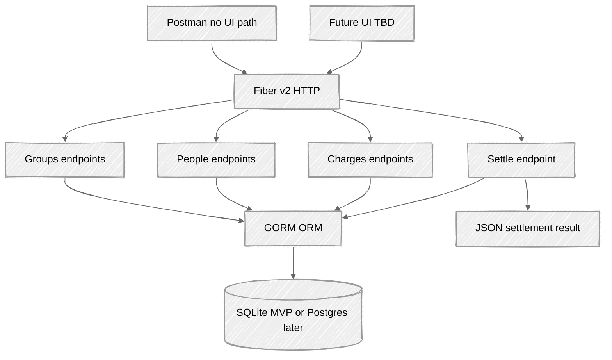
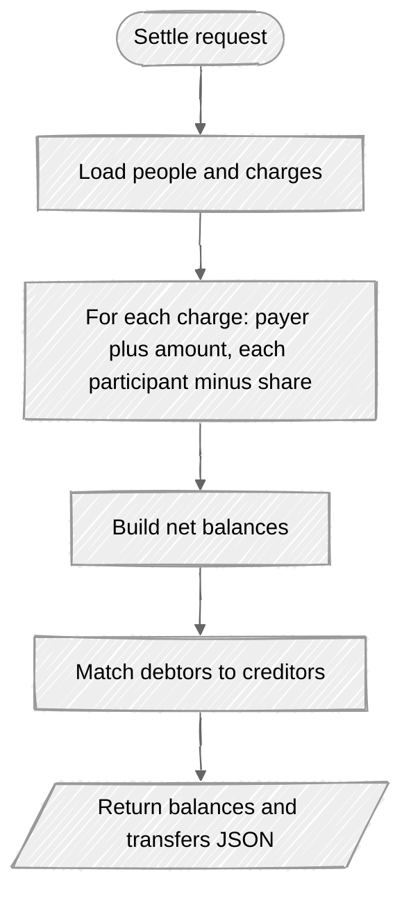

# Practicum Project — Deliverable #1

**Student:** Nanlin  
**Course:** CMSC501-1 Structure of Programming Language — Summer 2026  
**Repository:** https://github.com/uona-cmsc501-1-summer2026-nanlin/practicum-project  
**Language:** Go (Golang)  
**Compared with:** Python and C#

---

## 1. Topic of the program

**Shared Bill Splitter (REST API)** — a small HTTP service that accepts people, shared charges, and split rules, then returns who owes whom and how much. A client UI is optional / TBD; until a UI exists, endpoints can be exercised with **Postman** (or curl).

---

## 2. Description of the program

### Task
Solve a common real-life problem: when roommates, friends, or trip partners share costs, uneven payments create confusion and conflict. The tool answers: given who paid what and how we agreed to split, what does each person still owe?

Examples:

- Three roommates share rent and utilities; one person paid the full electric bill — how much should the others transfer?
- A trip group has food, hotel, and gas; some people paid more — settle the balances fairly.

### Approach
1. Model people (name or ID) and charges (description, amount, who paid, who should share the cost).
2. Build the API with **Go Fiber v2** — a lightweight, Express-style framework on top of **fasthttp**, with a simple route/handler model. **MVP serves plain HTTP** (no TLS in this project plan). If the service later goes live on the cloud, TLS with certificates can be considered then (e.g. Fiber `ListenTLS` or a reverse proxy / load balancer).
3. Expose a simple **RESTful API** (JSON in / JSON out) so any client can use the logic — curl, Postman, or a future UI.
4. Persist data in a **database** (required): people and charges must survive restarts, not only live in memory.
5. Use **GORM** as the ORM — simple to integrate with Go structs and keeps data access straightforward.
6. Database choice: **SQLite** (local file) for the local MVP / demo product; **PostgreSQL** is an option later if the service needs multi-user or networked persistence.
7. Support split rules: equal split, or only among selected people (e.g. someone did not use an item).
8. Compute each person's net balance (paid minus share owed) and return a settlement summary (who pays whom, per-person totals).
9. **UI (TBD):** a thin front end can call the same endpoints later. Until then, **Postman** is the primary client path for demo and testing (send JSON requests, inspect JSON responses) — no UI required.
10. Use **version control** on **GitHub** (repo already created). Milestone work is shared via milestone-specific commits, with **branch control**, **version tags**, and ongoing docs updates in the repo.
11. Deliverable #1 focuses on the problem definition, API + data approach, and language/framework choice.

### Version control and milestone workflow
The project uses **Git** hosted on **GitHub**:  
https://github.com/uona-cmsc501-1-summer2026-nanlin/practicum-project

**Why GitHub (vs GitLab):**
- Familiar for coursework and personal projects; easy to share a public/private course repo with instructors or peers
- Strong fit for a small Go project: README at root, docs folder, issues/PRs if needed later, and simple clone/push from any machine
- Built-in support for the practices we need: branches, tags/releases, and markdown docs next to the code
- Wide ecosystem (Actions available later if CI is useful); GitLab is capable too, but GitHub was chosen for simplicity and familiarity for this practicum

**Workflow:**
- Share progress with **milestone-specific commits** tied to each deliverable / milestone
- Use **branch control** (e.g. feature/milestone branches merged into `main`) so work stays reviewable and isolated
- Apply **version tags** (e.g. `v0.1-d1`, `v0.2-api`) to mark stable milestone snapshots
- Keep adding **docs** in the repo (`README.md`, `docs/deliverable1.md`, later OAS 3/Swagger) as the project grows

### Why Fiber v2 (lightweight + simple implementation)
Fiber is designed for fast development with performance in mind: Express-inspired APIs, low boilerplate for routes/middleware, and fasthttp under the hood ([Fiber v2 docs](https://docs.gofiber.io/v2.x/); [pkg.go.dev fiber/v2](https://pkg.go.dev/github.com/gofiber/fiber/v2)).

**Illustrative benchmark / comparison figures** (lab-style HTTP routing; real apps are often DB-bound):

| Source | Claim / metric |
|--------|----------------|
| [Encore — Gin vs Echo vs Fiber (2026)](https://encore.dev/articles/gin-vs-echo-vs-fiber) | On a simple JSON endpoint (single-core style comparison): Fiber ~**130k req/sec** vs Gin/Echo ~**80k req/sec**; Fiber also noted for lower memory per request, built on fasthttp |
| [Appetizers — Go web frameworks production benchmarks (2026)](https://appetizers.io/en/blog/go-web-frameworks-production-performance-2026/) | Example throughput ranking includes Fiber ~**85k req/s**, Gin ~**78k**, Echo ~**75k**, Chi ~**72k**, stdlib ~**68k** |
| [Gin routing benchmarks (includes Fiber)](https://gin-gonic.com/en/docs/benchmarks/) | Fiber shows **0 B/op** and **0 allocs/op** in the GitHub-API routing suite (zero-alloc path); note: Fiber uses fasthttp, so absolute ns/op should not be compared naively to `net/http` routers |

**Takeaway for this project:** Fiber keeps implementation simple (small handlers, clear routing) while staying lightweight and high-throughput enough for a bill-split microservice-style API. **This project’s MVP uses HTTP only** (no TLS). TLS with certificates is out of scope here and would only be considered if deploying live to the cloud later.

### API design (endpoints, params, bodies)

Base URL (local MVP): `http://localhost:55555/api/v1`  
(HTTP only for MVP; no TLS/certs in this project plan)

**Coming milestones:** We will publish an **OpenAPI Specification 3 (OAS 3) / Swagger** document for these endpoints so Postman import, client generation, and (later) UI work stay aligned with a single contract. Deliverable #1 defines the design; the formal OAS 3/Swagger file lands in a later milestone.

**Resource model**
- **Group** — one split session (e.g. “July trip”, “Apartment July”)
- **Person** — member of a group
- **Charge** — shared expense: who paid, amount, who shares it
- **Settlement** — computed who-owes-whom result (not stored as editable rows in MVP)

#### Overview

| Method | Endpoint | Purpose |
|--------|----------|---------|
| `POST` | `/api/v1/groups` | Create a split group |
| `GET` | `/api/v1/groups` | List groups |
| `GET` | `/api/v1/groups/:groupId` | Get one group |
| `DELETE` | `/api/v1/groups/:groupId` | Delete a group (and its people/charges) |
| `POST` | `/api/v1/groups/:groupId/people` | Add a person |
| `GET` | `/api/v1/groups/:groupId/people` | List people in the group |
| `GET` | `/api/v1/groups/:groupId/people/:personId` | Get one person |
| `DELETE` | `/api/v1/groups/:groupId/people/:personId` | Remove a person |
| `POST` | `/api/v1/groups/:groupId/charges` | Add a shared charge |
| `GET` | `/api/v1/groups/:groupId/charges` | List charges (optional query filters) |
| `GET` | `/api/v1/groups/:groupId/charges/:chargeId` | Get one charge |
| `DELETE` | `/api/v1/groups/:groupId/charges/:chargeId` | Delete a charge |
| `POST` | `/api/v1/groups/:groupId/settle` | Compute settlement (who owes whom) |

Path params use UUID or integer IDs from the DB (`:groupId`, `:personId`, `:chargeId`).

---

#### 1. Create group — `POST /api/v1/groups`

**Body**
```json
{
  "name": "July beach trip",
  "currency": "USD"
}
```

**Response `201`**
```json
{
  "id": 1,
  "name": "July beach trip",
  "currency": "USD",
  "createdAt": "2026-07-18T12:00:00Z"
}
```

#### 2. List / get groups

- `GET /api/v1/groups` → `200` array of groups  
- `GET /api/v1/groups/:groupId` → `200` one group (`404` if missing)  
- `DELETE /api/v1/groups/:groupId` → `204`

**Query (list, optional):** `?name=beach` (substring match on group name)

---

#### 3. Add person — `POST /api/v1/groups/:groupId/people`

**Path:** `groupId` (required)

**Body**
```json
{
  "name": "Alex",
  "email": "alex@example.com"
}
```

**Response `201`**
```json
{
  "id": 10,
  "groupId": 1,
  "name": "Alex",
  "email": "alex@example.com"
}
```

#### 4. List / get / delete people

- `GET /api/v1/groups/:groupId/people` → `200` array  
- `GET /api/v1/groups/:groupId/people/:personId` → `200`  
- `DELETE /api/v1/groups/:groupId/people/:personId` → `204`

**Query (list, optional):** `?name=Alex`

---

#### 5. Add charge — `POST /api/v1/groups/:groupId/charges`

**Path:** `groupId` (required)

**Body**
```json
{
  "description": "Dinner",
  "amount": 90.00,
  "paidByPersonId": 10,
  "participantIds": [10, 11, 12],
  "splitRule": "equal"
}
```

| Field | Type | Notes |
|-------|------|--------|
| `description` | string | Required |
| `amount` | number | Required, > 0 |
| `paidByPersonId` | int | Required; must belong to the group |
| `participantIds` | int[] | Who shares this charge; if omitted, all people in the group |
| `splitRule` | string | MVP: `"equal"` only (room for `"custom"` later) |

**Response `201`**
```json
{
  "id": 100,
  "groupId": 1,
  "description": "Dinner",
  "amount": 90.00,
  "paidByPersonId": 10,
  "participantIds": [10, 11, 12],
  "splitRule": "equal",
  "sharePerPerson": 30.00
}
```

#### 6. List / get / delete charges

- `GET /api/v1/groups/:groupId/charges` → `200` array  
- `GET /api/v1/groups/:groupId/charges/:chargeId` → `200`  
- `DELETE /api/v1/groups/:groupId/charges/:chargeId` → `204`

**Query (list, optional)**

| Query param | Example | Meaning |
|-------------|---------|---------|
| `paidBy` | `?paidBy=10` | Only charges paid by this person ID |
| `minAmount` | `?minAmount=50` | Amount >= value |
| `maxAmount` | `?maxAmount=200` | Amount <= value |
| `q` | `?q=dinner` | Description contains text |

Example: `GET /api/v1/groups/1/charges?paidBy=10&minAmount=50`

---

#### 7. Settle — `POST /api/v1/groups/:groupId/settle`

Computes balances from all charges in the group and returns simplified transfers.

**Path:** `groupId` (required)

**Body (optional filters)**
```json
{
  "onlyChargeIds": null
}
```

- Omit body or set `onlyChargeIds` to `null` → settle **all** charges in the group  
- Or pass `"onlyChargeIds": [100, 101]` to settle a subset

**Response `200`**
```json
{
  "groupId": 1,
  "currency": "USD",
  "balances": [
    { "personId": 10, "name": "Alex", "net": 40.00 },
    { "personId": 11, "name": "Sam", "net": -20.00 },
    { "personId": 12, "name": "Jordan", "net": -20.00 }
  ],
  "transfers": [
    { "fromPersonId": 11, "fromName": "Sam", "toPersonId": 10, "toName": "Alex", "amount": 20.00 },
    { "fromPersonId": 12, "fromName": "Jordan", "toPersonId": 10, "toName": "Alex", "amount": 20.00 }
  ]
}
```

`net` > 0 means others owe this person; `net` < 0 means this person owes others. `transfers` is the simplified “who pays whom” list for Postman/UI display.

---

#### Error shape (all endpoints)

```json
{
  "error": "person not found in group",
  "code": "NOT_FOUND"
}
```

Common status codes: `400` validation, `404` missing resource, `500` server error.

---

#### Postman demo flow (no UI)

1. `POST /api/v1/groups` → save `groupId`  
2. `POST .../people` (×N) → save `personId`s  
3. `POST .../charges` (×M) with `paidByPersonId` + `participantIds`  
4. `POST .../settle` → read `transfers`  
5. Optional: `GET .../charges?minAmount=50` to show criteria-style filtering



This stays a **simple daily-life service**: fair settlement via Fiber endpoints + a small DB, not a full enterprise accounting platform. While the **UI is TBD**, **Postman** covers the full demo path against the same REST endpoints; a UI can plug in later without redesigning the API.

### Backend calculation pseudocode

High-level logic the Fiber handlers will run (not full Go yet — for design / PPT clarity).

#### Add charge — equal split share

When `POST /api/v1/groups/:groupId/charges` runs with `splitRule = "equal"`:

```vbnet
function addCharge(groupId, description, amount, paidByPersonId, participantIds, splitRule)
  if amount <= 0 then
    return error 400 "amount must be > 0"
  end if
  if person paidByPersonId not in group then
    return error 404 "payer not in group"
  end if

  if participantIds is empty then
    participantIds = all person ids in group
  end if

  for each id in participantIds
    if id not in group then
      return error 404 "participant not in group"
    end if
  end for

  n = count(participantIds)
  sharePerPerson = amount / n

  save charge to DB via GORM
  return charge with sharePerPerson
end function
```

**Example:** Dinner `$90`, participants Alex/Sam/Jordan → `sharePerPerson = 30.00`.

---

#### Settle — net balances then who pays whom

When `POST /api/v1/groups/:groupId/settle` runs:

```vbnet
function settle(groupId, onlyChargeIds)
  people = load people for groupId
  charges = load charges for groupId
  if onlyChargeIds is not null then
    charges = filter charges where id in onlyChargeIds
  end if

  // Step 1: net balance per person (paid - owed)
  for each person p in people
    balance[p.id] = 0
  end for

  for each charge c in charges
    balance[c.paidByPersonId] = balance[c.paidByPersonId] + c.amount
    share = c.amount / count(c.participantIds)
    for each pid in c.participantIds
      balance[pid] = balance[pid] - share
    end for
  end for

  // Step 2: split into creditors (net > 0) and debtors (net < 0)
  creditors = people where balance > 0   // others owe them
  debtors   = people where balance < 0   // they owe others
  // round tiny floating leftovers toward 0 as needed

  // Step 3: match debtors to creditors (greedy simplify)
  transfers = empty list
  i = 0
  j = 0
  while i < count(debtors) AND j < count(creditors)
    pay = min( -balance[debtors[i]], balance[creditors[j]] )
    append transfer:
      from = debtors[i]
      to   = creditors[j]
      amount = pay
    balance[debtors[i]]   = balance[debtors[i]] + pay
    balance[creditors[j]] = balance[creditors[j]] - pay
    if balance[debtors[i]] is about 0 then i = i + 1
    if balance[creditors[j]] is about 0 then j = j + 1
  end while

  return balances and transfers as JSON
end function
```

**Example (same dinner):** Alex paid `$90`, three equal shares → Alex net `+60`, Sam `-30`, Jordan `-30` → transfers: Sam→Alex `$30`, Jordan→Alex `$30`.



---

## 3. Reason for the chosen language

### Core claim
For a small, deployable REST tool that may grow (more users, optional UI, light scale), **Go is the best fit**. Python is strong for quick API prototypes. C# / ASP.NET is strong for large enterprise services, but heavier than this problem needs.

### Compare and contrast

| Axis | Go | Python | C# |
|------|----|--------|-----|
| Typing | Static, compile-time checks | Dynamic; errors often at runtime | Static, rich type system / CLR |
| Memory | Built-in **garbage collector (GC)**; less manual memory work than C/C++, still efficient for services | GC via interpreter runtime | GC via CLR |
| Build / environment | Compile once; little worry about target runtime version on the machine | Interpreter + venv/deps; version and env drift are common | Needs .NET runtime or published artifacts; heavier toolchain |
| Cross-OS delivery | Straightforward OS-specific server binaries (`GOOS` / `GOARCH`) | Possible to package, but harder to manage and maintain | `dotnet publish` works; more ceremony for a small API |
| Team collaboration | Shared binary + `go.mod` keeps builds consistent across people | Multi-person teams often hit env/version/dependency mismatches | Strong for large enterprise teams, but more stack weight |
| HTTP / concurrency | **Fiber v2** + goroutines; fasthttp-based, microservice-style small services | Flask/FastAPI are fast to write; GIL limits some concurrency | ASP.NET is excellent for enterprise APIs and heavy server-side work |
| Data access | **GORM** integrates cleanly with structs; SQLite or Postgres | SQLAlchemy / Django ORM common | EF Core common in enterprise |
| Fit for this task | Lightweight Fiber REST + DB + optional UI later | Fastest to sketch endpoints | Overkill for a simple bill-split API; better for large business services |

### How the decision was derived
1. The problem is a **simple daily-life settlement API**, not a large corporate finance platform.
2. Go compiles to **OS-specific executables** without depending on a matching runtime/version on every machine — easier to deploy and share.
3. Go’s **GC** reduces memory-management burden while remaining suitable for long-running API processes.
4. Go fits a **microservice-like** shape well: a focused service with clear HTTP boundaries that can stay small or scale out later.
5. **Fiber v2** keeps routing/handlers simple to implement while staying lightweight and high-throughput (fasthttp; see benchmark links above). MVP runs over **HTTP**; TLS with certificates is not part of this project plan and would only be considered for a later cloud go-live.
6. Python can also run a small API (e.g. FastAPI), but managing environments, versions, and dependencies is harder to **maintain and collaborate on** across a multi-person team.
7. C# is excellent for enterprise web/services (ASP.NET), but that stack is heavier than a focused bill-split REST tool needs.
8. Persistence is required; **GORM** keeps ORM usage simple in Go. **SQLite** is best for a local MVP demo (single file, no separate DB server); **PostgreSQL** remains an option if the product grows beyond a local demo.
9. Go sits where this project needs to be: **typed, GC-backed, Fiber for a simple fast API, team-friendly builds, and a clear path to scale** (and optionally add a UI) without enterprise ceremony.

### Research notes / references
- [Fiber v2 documentation](https://docs.gofiber.io/v2.x/) — Express-inspired, fasthttp, performance-focused
- [Fiber v2 on pkg.go.dev](https://pkg.go.dev/github.com/gofiber/fiber/v2)
- [Encore: Gin vs Echo vs Fiber](https://encore.dev/articles/gin-vs-echo-vs-fiber) — throughput comparison (~130k vs ~80k req/sec style figures)
- [Appetizers: Go web framework production benchmarks](https://appetizers.io/en/blog/go-web-frameworks-production-performance-2026/) — Fiber/Gin/Echo/Chi ranking
- [Gin docs benchmarks (includes Fiber)](https://gin-gonic.com/en/docs/benchmarks/) — zero-alloc note + fasthttp caveat
- GORM documentation; SQLite vs PostgreSQL for local MVP vs multi-user deployment
- Go garbage collector overview and cross-compilation / single binary deployment
- Python packaging / venv; .NET / ASP.NET for C# web APIs

---

## My Personal Notes for Presentation

Some points/thoughts I would like to talk about / put on PPT slides for deliverable #1 presentation.

**Slide — Problem**
- Daily-life pain: roommates / trips / shared bills → confusion about who owes whom
- Goal: fair settlement from “who paid what” + split rules

**Slide — Solution overview**
- Shared Bill Splitter as a small REST API (not a heavy enterprise app)
- Fiber v2 + GORM + SQLite (local MVP); Postgres optional later
- HTTP only for MVP (no TLS in this project); TLS/certs only if later cloud go-live
- UI TBD; demo/test with **Postman** on the same endpoints

**Slide — How it works (high level)**
- Groups → People → Charges → Settle
- Settle returns balances + simplified transfers (“who pays whom”)
- Equal split: `share = amount / participants`; settle: net = paid − owed, then match debtors → creditors
- Later milestone: OAS 3 / Swagger spec for the API contract

**Slide — Why Go (vs Python and C#)**
- Go: OS-specific binaries, low env/version friction, GC, microservice-style HTTP services, easier team consistency (`go.mod`)
- Python: fast to prototype, but env/deps harder to manage and collaborate on
- C#: strong for enterprise ASP.NET services; heavier than this simple tool needs

**Slide — Why Fiber v2**
- Lightweight, simple handlers/routing (Express-style)
- Built on fasthttp; cite 1–2 benchmark links from the write-up
- Fits a small focused API service

**Slide — Data & tooling**
- DB required; GORM for simple ORM integration
- SQLite file for local MVP demo; Postgres if the product grows
- Version control: **GitHub** chosen for familiarity and simple branching/tags/docs; milestone commits and tags over time
  - Repo: https://github.com/uona-cmsc501-1-summer2026-nanlin/practicum-project

**Slide — Closing**
- Deliverable #1 = topic + approach + language/framework rationale
- Next steps: implement API, OAS 3/Swagger, milestone tags in the repo

