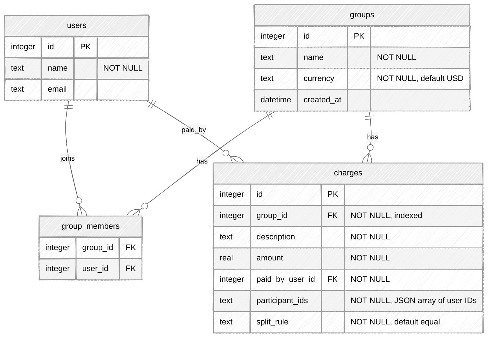
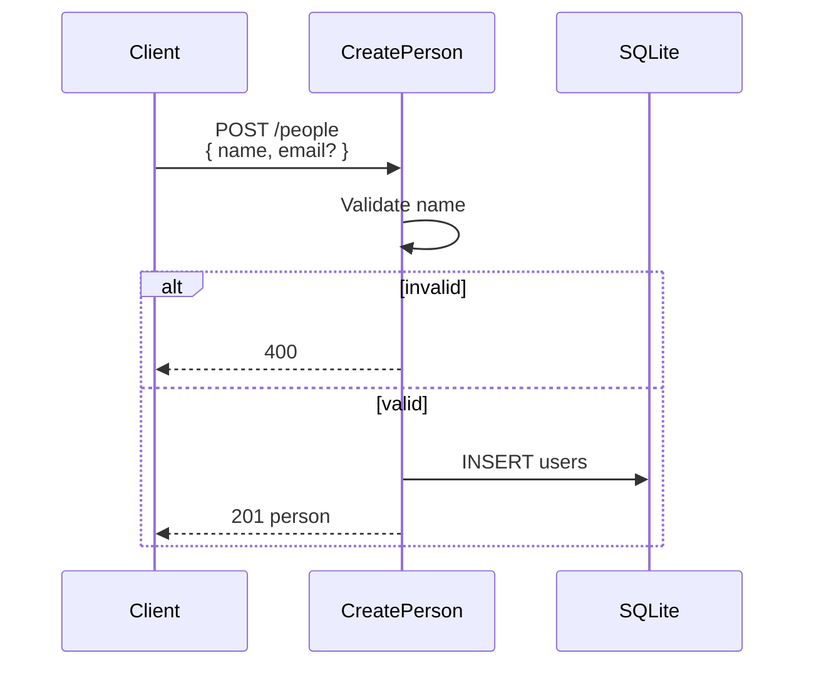
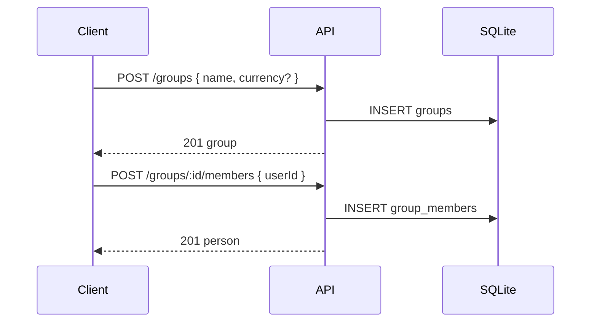
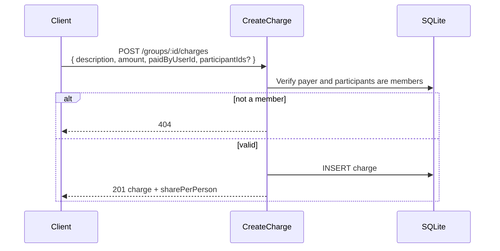
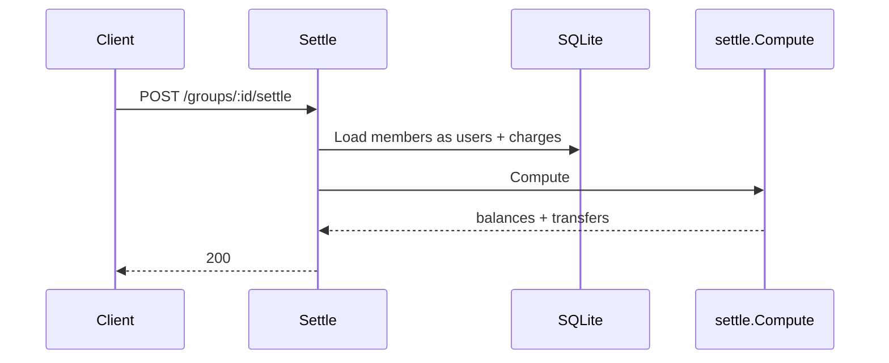

# deliverable2 / API companion

**Repository:** https://github.com/uona-cmsc501-1-summer2026-nanlin/practicum-project

**Shared Bill Splitter** — how a client interacts with the REST API.

Base URL: `http://localhost:55555/api/v1`  
UI: `http://localhost:55555/app/`

The client (Postman, `curl`, or the minimal UI) sends **JSON input** over HTTP. The API validates the request, reads/writes SQLite, and returns **JSON output** in a standard envelope (`success` + `data`, or `error` + status code).

---

## Database schema

SQLite database (`billsplitter.db`) managed by GORM AutoMigrate.

After upgrading from Deliverable #2, **delete `billsplitter.db`** so AutoMigrate creates the new tables cleanly.



### Relationships

| From | To | Cardinality | How |
|------|----|-------------|-----|
| `users` | `group_members` | 1 : N | `group_members.user_id` → `users.id` |
| `groups` | `group_members` | 1 : N | `group_members.group_id` → `groups.id` |
| `groups` | `charges` | 1 : N | `charges.group_id` → `groups.id` |
| `users` | `charges` | 1 : N (payer) | `charges.paid_by_user_id` → `users.id` |
| `users` | `charges` | N : M (participants) | `charges.participant_ids` stores a JSON array of user IDs |

### Notes

- **Four tables** — `users`, `group_members`, `groups`, `charges` — settle results are computed on read.
- **People are global** — one `users` row can join many groups via `group_members`.
- **Participants** are stored as JSON text on each charge. The API exposes them as `participantIds`.
- Payer and participants on a charge must already be **members** of that group.

---

## Dependencies (`go.mod`)

Direct dependencies from `go.mod`:

```go
require (
	github.com/gobeetle/reply v0.5.0
	github.com/gofiber/fiber/v2 v2.52.9
	github.com/pb33f/libopenapi v0.34.2
	gorm.io/driver/sqlite v1.5.7
	gorm.io/gorm v1.25.12
)
```

---

## Swagger / OpenAPI

With the server running (`go run .`):

| Resource | URL |
|----------|-----|
| **App UI** | http://localhost:55555/app/ |
| **Swagger UI** | http://localhost:55555/swagger |
| **OpenAPI spec (JSON)** | http://localhost:55555/swagger/specification |

Source spec: `docs/swagger/` (merged file: `docs/swagger/generate/openapi.yaml`). Regenerate with `make oas`.

---

## Sequence diagrams

### 1. Create person (global)



### 2. Create group and add members



### 3. Add charge



### 4. Settle



---

## Demo sequence

| Step | Input (HTTP) | Output |
|------|--------------|--------|
| 1 | `POST /people` — `{ "name", "email" }` | `201` — person `id` |
| 2 | `POST /groups` — `{ "name", "currency" }` | `201` — group `id` |
| 3 | `POST /groups/:id/members` — `{ "userId" }` | `201` — person |
| 4 | `POST /groups/:id/charges` — amount, payer, participants | `201` — charge + `sharePerPerson` |
| 5 | `POST /groups/:id/settle` | `200` — `balances` + `transfers` |

See [deliverable3.md](deliverable3.md) for the final deliverable plan and UI scope.
