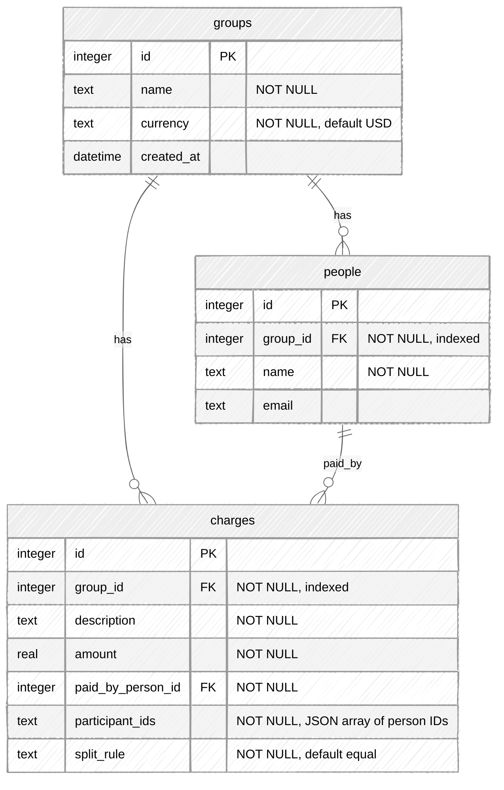
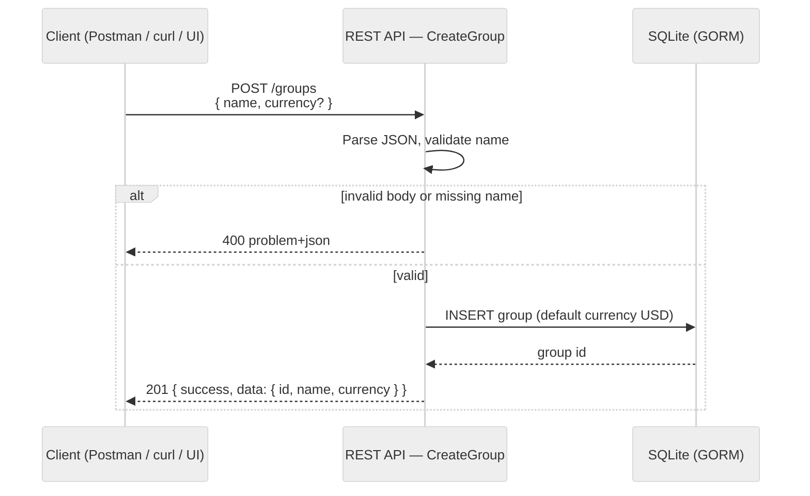
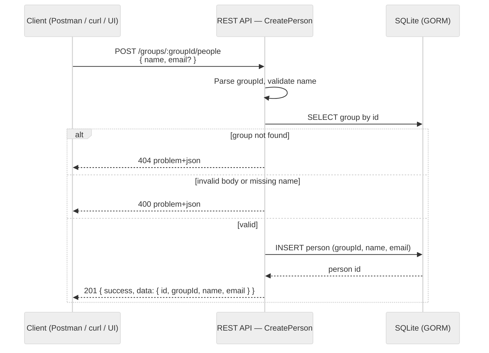
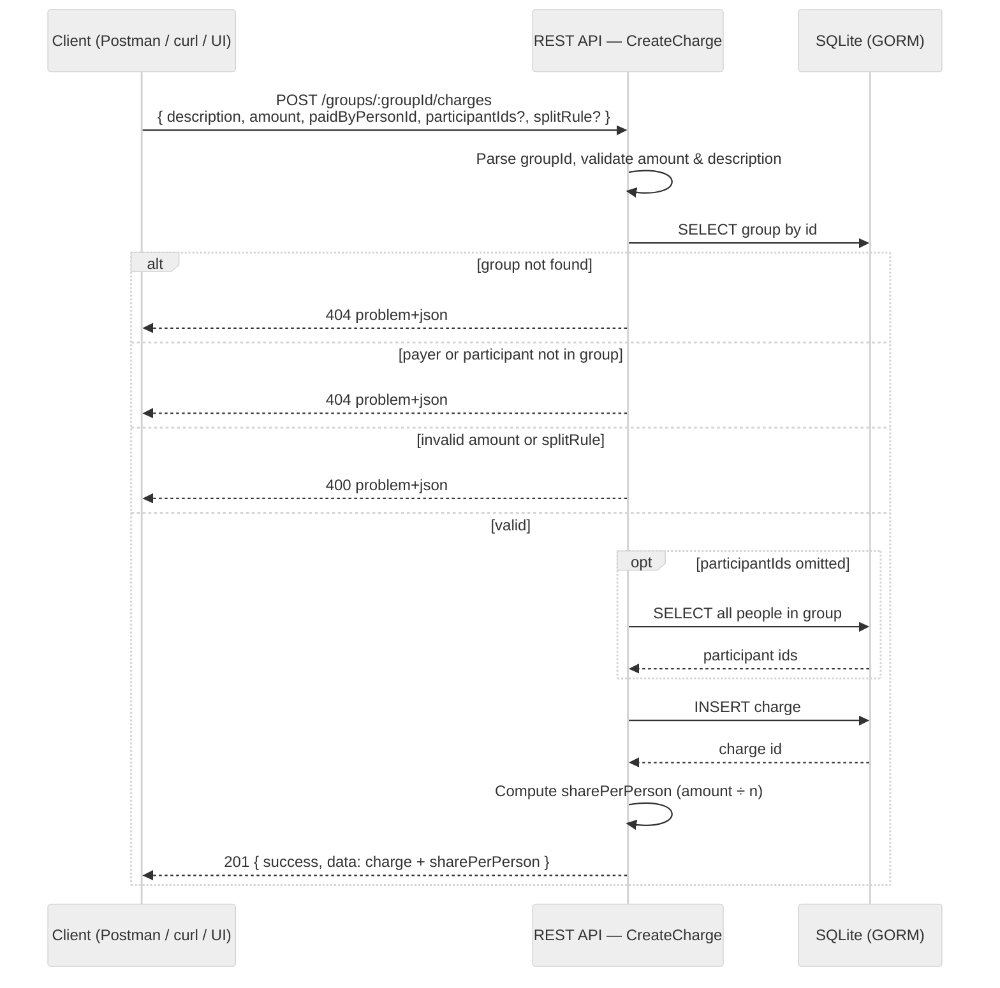
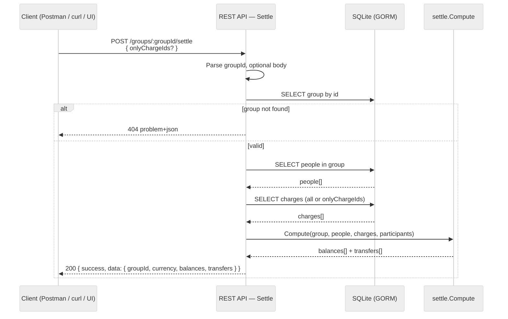

# deliverable2

**Repository:** https://github.com/uona-cmsc501-1-summer2026-nanlin/practicum-project

**Shared Bill Splitter** — how a client interacts with the REST API.

Base URL: `http://localhost:55555/api/v1`

The client (Postman, `curl`, or future UI) sends **JSON input** over HTTP. The API validates the request, reads/writes SQLite, and returns **JSON output** in a standard envelope (`success` + `data`, or `error` + status code).

---

## Database schema

SQLite database (`billsplitter.db`) managed by GORM AutoMigrate.



### Relationships

| From | To | Cardinality | How |
|------|----|-------------|-----|
| `groups` | `people` | 1 : N | `people.group_id` → `groups.id` |
| `groups` | `charges` | 1 : N | `charges.group_id` → `groups.id` |
| `people` | `charges` | 1 : N (payer) | `charges.paid_by_person_id` → `people.id` |
| `people` | `charges` | N : M (participants) | `charges.participant_ids` stores a JSON array of person IDs (no join table) |

### Notes

- **Three tables** — `groups`, `people`, `charges` — no separate settlement or transfer tables; settle results are computed on read.
- **Participants** are stored as JSON text on each charge, not as foreign-key rows. The API exposes them as `participantIds` in JSON responses.
- **Indexes** exist on `people.group_id` and `charges.group_id` for listing people/charges within a group.

---

## Dependencies (`go.mod`)

Direct dependencies from `go.mod`:

```go
require (
	github.com/gobeetle/reply v0.5.0
	github.com/gofiber/fiber/v2 v2.52.9
	github.com/pb33f/libopenapi v0.34.2
	gorm.io/driver/sqlite v1.5.7
	gorm.io/gorm v1.25.12
)
```

- **fiber/v2** — HTTP server, routes, and middleware
- **gobeetle/reply** — JSON success/error response envelope
- **gorm** + **driver/sqlite** — ORM and SQLite database access
- **libopenapi** — serves Swagger UI and the live OpenAPI spec

---

## Swagger / OpenAPI

With the server running (`go run .`):

| Resource | URL |
|----------|-----|
| **Swagger UI** | http://localhost:55555/swagger |
| **OpenAPI spec (JSON)** | http://localhost:55555/swagger/specification |

Source spec: `docs/swagger/` (merged file: `docs/swagger/generate/openapi.yaml`). Regenerate with `make oas`. Postman collection: `docs/swagger/postman/Shared-Bill-Splitter.postman_collection.json`.

---

## Sequence diagrams

### 1. Add group



### 2. Add people



Repeat for each person in the group (Alex, Sam, Jordan, …).

### 3. Add charge (repeat for each transaction)



Loop: call again for Dinner, Groceries, Gas, … until all shared expenses are recorded.

### 4. Settle



Invalid requests at any step return `400` (validation) or `404` (not found) with `application/problem+json`.

---

## Demo sequence

| Step | Input (HTTP) | Output |
|------|--------------|--------|
| 1 | `POST /groups` — `{ "name", "currency" }` | `201` — group `id` |
| 2 | `POST /groups/:id/people` — `{ "name", "email" }` | `201` — person `id` |
| 3 | `POST /groups/:id/charges` — amount, payer, participants | `201` — charge + `sharePerPerson` |
| 4 | `POST /groups/:id/settle` — optional `onlyChargeIds` | `200` — `balances` + `transfers` |

Invalid requests return `400` (validation) or `404` (not found) with `application/problem+json`.

See [deliverable2.md](deliverable2.md) for sample request/response bodies.

---

## To-do (final deliverable)

Goal: **global people** (reuse one person across groups) + **minimal UI**. Details: [deliverable3.md](deliverable3.md).

- [ ] Refactor DB — `users` + `group_members`; migrate charges; drop `people`
- [ ] Global people API — `POST/GET/DELETE /api/v1/people`
- [ ] Group membership API — add/list/remove members on a group
- [ ] Update charges, settle, Swagger, and Postman
- [ ] Add more unit tests — handlers, settle edge cases, and integration/demo coverage
- [ ] Minimal web UI — People page, Groups page, Group detail (members, charges, settle)

Optional later: edit records, charge edit/delete in UI, search, dark mode.
