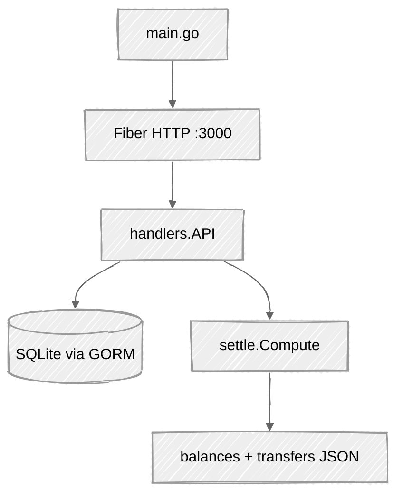

# Practicum Project — Deliverable #2

**Student:** Nanlin  
**Course:** CMSC501-1 Structure of Programming Language — Summer 2026  
**Repository:** https://github.com/uona-cmsc501-1-summer2026-nanlin/practicum-project  
**Language:** Go (Golang) + Fiber v2 + GORM + SQLite  

---

## 1. Identify and explain the program

### What it is
**Shared Bill Splitter** is a small HTTP REST API that helps roommates or trip partners settle shared costs. Users create a **group**, add **people**, record **charges** (who paid, who shares), then call **settle** to get net balances and a simplified “who pays whom” list.

Demo client for this milestone: **Postman** / `curl` (UI still TBD).  
Base URL: `http://localhost:3000/api/v1` (HTTP only).

### How to run
```bash
cd practicum-project
go run .
# or: go build -o billsplitter.exe . && ./billsplitter.exe
```
Default DB file: `billsplitter.db` (SQLite). Optional env: `DB_PATH`, `ADDR` (default `:3000`).

### Project layout (skeleton / code)

| Path | Role |
|------|------|
| `main.go` | Starts Fiber app, opens SQLite via GORM, registers routes, `/health` |
| `internal/models/models.go` | Structs for DB entities and request/response JSON |
| `internal/database/database.go` | Connect + AutoMigrate |
| `internal/handlers/handlers.go` | HTTP handlers (validation, CRUD, settle endpoint) |
| `internal/settle/settle.go` | Pure settlement math (balances + transfers) |
| `docs/deliverable1.md` | Design / language rationale (D1) |
| `docs/deliverable2.md` | This document (code + sample results) |



### What each package / type is designed to do

#### `main`
- Open DB (`database.Connect`)
- Create Fiber app with logger + CORS
- Mount `handlers.API.Register`
- Listen on `:3000`

#### `internal/models`
- **`Group` / `Person` / `Charge`** — persisted entities (GORM)
- **`Create*Request` / `SettleRequest`** — inbound JSON bodies
- **`ChargeResponse` / `SettleResponse` / `BalanceRow` / `TransferRow`** — outbound JSON
- **`ErrorBody`** — `{ "error", "code" }` for invalid/missing input

#### `internal/database`
- **`Connect(path)`** — open SQLite file and AutoMigrate tables

#### `internal/handlers` (`API` struct)
| Function | Purpose |
|----------|---------|
| `CreateGroup` / `ListGroups` / `GetGroup` / `DeleteGroup` | Group CRUD + optional `?name=` filter |
| `CreatePerson` / `ListPeople` / `GetPerson` / `DeletePerson` | People under a group |
| `CreateCharge` / `ListCharges` / `GetCharge` / `DeleteCharge` | Charges; validates amount, payer, participants; list filters `paidBy`, `minAmount`, `maxAmount`, `q` |
| `Settle` | Loads people/charges, calls `settle.Compute`, returns JSON |
| `Register` | Wires all `/api/v1/...` routes |
| `fail` | Standard error JSON + status |

#### `internal/settle`
- **`Compute(...)`** — for each charge: payer `+amount`, each participant `-amount/n`; then greedy match debtors → creditors into `transfers`

### Core settlement idea (equal split)
Alex pays Dinner **$90** shared by Alex, Sam, Jordan → share **$30** each → nets Alex **+$60**, Sam **-$30**, Jordan **-$30** → transfers Sam→Alex $30, Jordan→Alex $30.

---

## 2. Results from different inputs (valid and invalid)

All samples below were run against a live local server (`go build` + `billsplitter.exe`, SQLite `demo.db`).

### Valid flow

**1. Create group — `201`**
```http
POST /api/v1/groups
{"name":"July beach trip","currency":"USD"}
```
```json
{"id":1,"name":"July beach trip","currency":"USD","createdAt":"2026-07-23T20:51:12.3547939-04:00"}
```

**2. Add people — `201`**
```json
{"id":1,"groupId":1,"name":"Alex","email":"alex@example.com"}
{"id":2,"groupId":1,"name":"Sam","email":"sam@example.com"}
{"id":3,"groupId":1,"name":"Jordan","email":"jordan@example.com"}
```

**3. Add charge (Dinner $90) — `201`**
```json
{
  "id": 1,
  "groupId": 1,
  "description": "Dinner",
  "amount": 90,
  "paidByPersonId": 1,
  "participantIds": [1, 2, 3],
  "splitRule": "equal",
  "sharePerPerson": 30
}
```

**4. Settle — `200`**
```json
{
  "groupId": 1,
  "currency": "USD",
  "balances": [
    {"personId": 1, "name": "Alex", "net": 60},
    {"personId": 2, "name": "Sam", "net": -30},
    {"personId": 3, "name": "Jordan", "net": -30}
  ],
  "transfers": [
    {"fromPersonId": 2, "fromName": "Sam", "toPersonId": 1, "toName": "Alex", "amount": 30},
    {"fromPersonId": 3, "fromName": "Jordan", "toPersonId": 1, "toName": "Alex", "amount": 30}
  ]
}
```

**5. Filter charges — `GET .../charges?minAmount=50` — `200`**
Returns the Dinner charge (amount 90 ≥ 50).

---

### Invalid input handling

The API does **not** crash on bad input. It returns JSON errors with HTTP status codes.

| Case | Request | Status | Response |
|------|---------|--------|----------|
| Empty group name | `POST /groups` `{"name":""}` | **400** | `{"error":"name is required","code":"VALIDATION"}` |
| Empty person name | `POST /groups/1/people` `{"name":""}` | **400** | `{"error":"name is required","code":"VALIDATION"}` |
| Unknown group | `POST /groups/999/people` | **404** | `{"error":"group not found","code":"NOT_FOUND"}` |
| Amount ≤ 0 | `POST .../charges` `amount: 0` | **400** | `{"error":"amount must be greater than 0","code":"VALIDATION"}` |
| Payer not in group | `paidByPersonId: 99` | **404** | `{"error":"payer not found in group","code":"NOT_FOUND"}` |
| Settle missing group | `POST /groups/999/settle` | **404** | `{"error":"group not found","code":"NOT_FOUND"}` |

**Example invalid response body:**
```json
{"error":"amount must be greater than 0","code":"VALIDATION"}
```

### How invalid input is handled (summary)
1. **Parse** JSON → if broken, `400 BAD_REQUEST`
2. **Validate** required fields / ranges → `400 VALIDATION`
3. **Lookup** group/person/charge in DB → `404 NOT_FOUND`
4. Valid paths write via GORM and return `201`/`200`/`204`

No TLS in MVP (HTTP only), matching Deliverable #1.

---

## Personal notes — points to talk about / put on PPT slides

**Slide — Recap**
- Shared Bill Splitter REST API in Go
- Fiber + GORM + SQLite; Postman/curl as client

**Slide — Code structure**
- `main` wires server; `models` = data shapes; `handlers` = HTTP + validation; `settle` = math; `database` = SQLite
- Point at 1–2 functions (e.g. `CreateCharge`, `settle.Compute`)

**Slide — Valid demo**
- Group → 3 people → Dinner $90 → Settle shows Alex +60, Sam/Jordan −30, two $30 transfers

**Slide — Invalid demo**
- Empty name → 400; amount 0 → 400; missing group / bad payer → 404
- Same error JSON shape every time

**Slide — Closing**
- Working MVP skeleton for D2; OAS 3/Swagger and optional UI later
- Repo: https://github.com/uona-cmsc501-1-summer2026-nanlin/practicum-project
