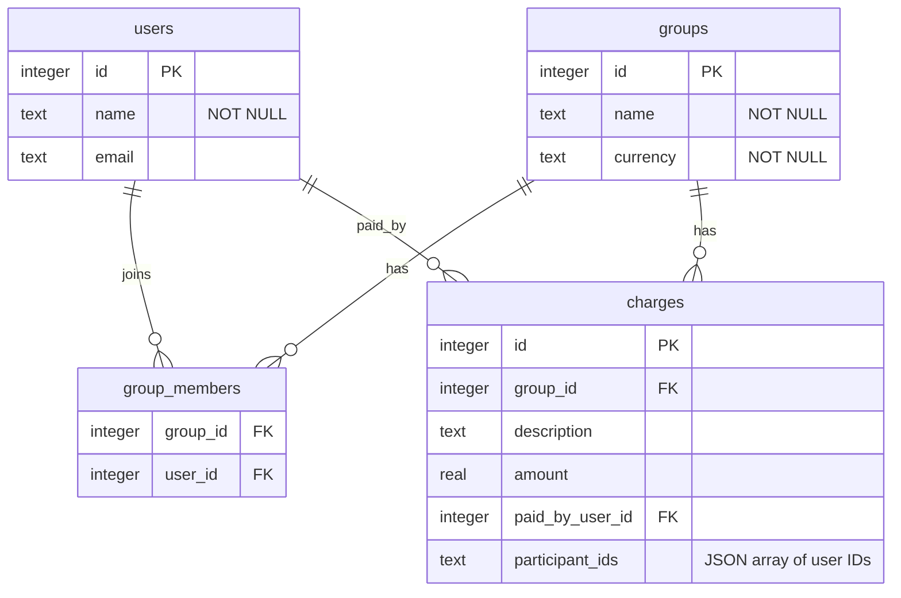

# Practicum Project — Final Deliverable (plan)

**Student:** Nanlin  
**Course:** CMSC501-1 Structure of Programming Language — Summer 2026  
**Repository:** https://github.com/uona-cmsc501-1-summer2026-nanlin/practicum-project  
**Language:** Go (Golang) + Fiber v2 + GORM + SQLite  
**Builds on:** [Deliverable #1](deliverable1.md) (design), [Deliverable #2](deliverable2.md) (MVP API)

---

## 1. Goal

Ship a **simple minimal UI** to manage **people**, **groups**, and **charges**, and refactor the data model so **people are global** (not duplicated per group).

**Current limitation (D2):** each `Person` row has a required `group_id`. The same human in two groups must be created twice. This is acceptable for the MVP but is marked for update here.

**Target:** one person record reused across groups; membership is a separate link; charges still belong to a group and reference global user IDs.

---

## 2. Phase 1 — Backend: separate people from groups

### Schema

- [ ] Add `users` table (`id`, `name`, `email`) — global identity, no `group_id`
- [ ] Add `group_members` join table (`group_id`, `user_id`, unique pair)
- [ ] Migrate `charges` to reference `user_id` (payer + participants) instead of group-scoped person IDs
- [ ] Drop old `people` table (or migrate existing rows → `users` + `group_members`)
- [ ] Update [project-2-doc.md](project-2-doc.md) (to-do and database schema sections)

### API — global people

- [ ] `POST /api/v1/people` — create person
- [ ] `GET /api/v1/people` — list all people
- [ ] `GET /api/v1/people/:id` — get one
- [ ] `DELETE /api/v1/people/:id` — delete (block if still in any group or on charges)

### API — group membership

- [ ] `GET /api/v1/groups/:groupId/members` — list members in group
- [ ] `POST /api/v1/groups/:groupId/members` — add existing person (`{ "userId": 1 }`)
- [ ] `DELETE /api/v1/groups/:groupId/members/:userId` — remove from group

### API — charges and settle

- [ ] Update charge validation: payer + participants must be **members** of that group
- [ ] Update settle to resolve names from global `users`
- [ ] Update Swagger + Postman collection
- [ ] Update tests (`handlers_test.go`, `settle_test.go`, demo script)

---

## 3. Phase 2 — Minimal UI

### Setup

- [ ] Add `web/` folder — plain HTML + CSS + vanilla JS (or Vite + minimal framework if preferred)
- [ ] Serve static files from Fiber (`/app` or root) or run UI on a second port with CORS
- [ ] Small `api.js` helper: `fetch` wrapper pointing at `http://localhost:55555/api/v1`

### People screen

- [ ] List all people (name, email)
- [ ] Form: add person
- [ ] Delete person (with confirm)

### Groups screen

- [ ] List groups
- [ ] Form: create group (name, currency)
- [ ] Click group → group detail view
- [ ] Delete group

### Group detail screen

- [ ] **Members** — show who is in the group; dropdown to add existing person; remove member
- [ ] **Charges** — list charges; form: description, amount, payer (dropdown), participants (checkboxes), split rule
- [ ] **Settle** — button calls `POST .../settle`; show balances + who-pays-whom table

### Polish (still minimal)

- [ ] Basic error messages from API (`400` / `404`)
- [ ] Empty states (“No people yet”, “No charges”)
- [ ] Simple nav: **People** | **Groups**

---

## 4. Phase 3 — Optional later (not required for final MVP)

- [ ] Edit person / edit group name
- [ ] Edit or delete individual charges from UI
- [ ] Search/filter people when adding to group
- [ ] Dark mode / mobile layout

---

## 5. Screen flow

```
People          Groups              Group detail
────────        ──────              ────────────
[+ Add]         [+ New group]       Members: Alex, Sam … [+ Add]
Alex            > July trip         Charges: Dinner $90 … [+ Add]
Sam             > Apartment         [Settle] → balances + transfers
```

---

## 6. Suggested order of work

1. **Backend refactor (Phase 1)** — UI depends on global people + membership endpoints
2. **People page first** — seed data without tying to a group
3. **Groups + members** — wire “add existing person to group”
4. **Charges + settle last** — needs members in place

---

## 7. Target schema (after Phase 1)



Settle logic stays largely the same: net balances and transfers are still computed per group; only identity resolution changes.

---

## Personal notes — points to talk about / put on PPT slides

**Slide — Why refactor people**
- D2: person tied to one group → duplicate entries for the same human
- Final: global `users` + `group_members` join table

**Slide — UI scope**
- Minimal: three areas (People, Groups, Group detail)
- No auth, no payments — same REST API as Postman demo

**Slide — Demo path**
- Create people once → create group → add members → add charge → settle in browser

**Slide — Closing**
- API-first MVP (D2) + thin UI (final) + cleaner data model for real-world reuse
